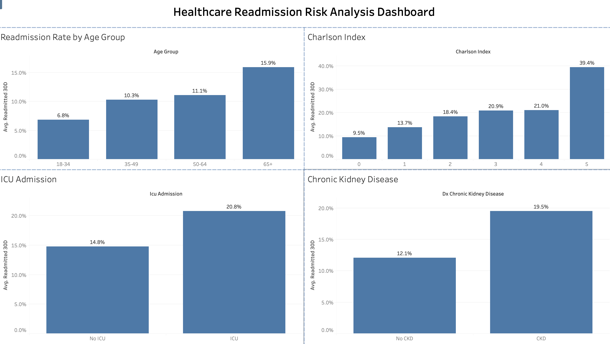

# Healthcare Readmission Analytics Project

## Project Overview

This project analyzes factors associated with 30-day hospital readmissions using a healthcare dataset containing 11,001 patient records. The analysis was conducted using Python, SQL, and Tableau to identify key risk factors and visualize findings through an interactive dashboard.

## Tools Used

- Python
- Pandas
- Matplotlib
- SQL (SQLite)
- Tableau
- Scikit-learn

## Dataset

The dataset contains 11,001 patient hospitalization records and includes patient demographics, clinical conditions, ICU admission status, insurance type, total hospital charges, and 30-day readmission outcomes.

## Key Findings

- The overall 30-day readmission rate was **14.94%**.
- Patients aged **65+** had the highest readmission rate (**15.94%**).
- Readmission risk increased as the **Charlson Comorbidity Index** increased.
- ICU patients experienced higher readmission rates (**20.82%**) than non-ICU patients (**14.80%**).
- Patients with Chronic Kidney Disease had a higher readmission rate (**19.55%**) than patients without CKD (**12.07%**).
- High-risk patients identified through SQL analysis had a readmission rate of **15.96%**, compared to **7.05%** for lower-risk patients.
- Balanced Logistic Regression achieved the best performance for identifying readmitted patients, with a recall score of **58%**.
- Addressing class imbalance significantly improved the model's ability to detect high-risk patients.
  
## Dashboard

## Repository Contents

## Repository Contents

- `healthcare_readmission_analysis.ipynb` — Data cleaning and exploratory data analysis
- `healthcare_sql_analysis.sql` — SQL-based healthcare readmission analysis
- `healthcare_readmission_dashboard.twbx` — Tableau dashboard
- `healthcare_readmission_prediction.ipynb` — Machine learning models for readmission prediction
- `dashboard.png` — Dashboard preview

## Skills Demonstrated

- Data Cleaning
- Exploratory Data Analysis
- SQL Query Development
- Data Visualization
- Dashboard Design
- Healthcare Analytics
